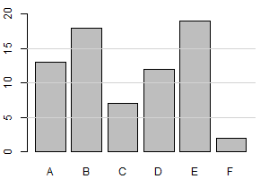

Kontroldarbs, var.`r I(var)`
----------


## 1. uzdevums

Datu sākotnējā apkopošana – tāllēkšanas rezultāti, jāsaliek pa grupām. 
Sakārtot pa kategorijām vai intervāliem.
Saskaitīt novērojumus, cik pieder katrai kategorijai vai intervālam.

1. Tāllēkšanas rezultāti -- aritm. vidējais 
(un arī vidējais no 3 labākajiem?).
1. Klasificēt Eiropas valstis pēc valsts iekārtas. 


## 2. uzdevums

Nolasīt skaitļus no tabulas, veikt vienkāršus aprēķinus. 
(Aizpildīt jaunu tabulas kolonnu no iepriekšējām; saskaitīt visu kopā, utt.)
Iedzīvotāju blīvumus; vai proporcijas; rēķināt skaitlīšus tabulā; 
saskaitīt kopā stabiņā. Skaitļi drīkst būt nesmuki (dažos gadījumos). 
Citos gadījumos skaitļiem jābūt smukiem. 
9 Latvijas pilsētas; Eiropas valstis Austrumeiropā; 20 Zemgales pašvaldības
(vai kaut kāda daļa no tām).


Tabulā apkopoti dati par dažām pašvaldībām (Avots: **raim.gov.lv**, 2013.g.).

```{r createtable, results='asis', echo=FALSE}
nums <- data.frame(pasv = c("Jelgava", "Jelgavas novads", "Ozolnieki"), 
                   col2 = c("A","B","c"),
                   col3 = c("D","E","F"), 
                   col4 = c("_____","_____","_____"))

if (prob01.questions[1,2] == "2") {
cat(sprintf("Pašvaldība | %s | %s | %s ", "Col2 XXX", "Col3", "Col4"),    
    "---:|---:|---:|---:|", sep="\n")
} else {
cat(sprintf("Pašvaldība | %s | %s | %s ", "Col2 XXX", "Col3", "Col4"),    
    "---:|---:|---:|---:|---:|", sep="\n")
} 

cat(apply(nums, 1, function(X) paste(X, collapse=" | ")), sep = "\n")
```


1. `r I(prob01.questions[1,1])`
1. Ierakstīt mērvienību šai skaitļu kolonnai.


## 3. uzdevums

Tabulā doti transporta līdzekļu atiešanas laiki. Cik ilgs laiks paiet 
no piektdienas vakara pēdējā reisa līdz nākamajam reisam? 
(Atbildi ierakstīt stundās un minūtēs, pa vidu rakstot divpunktu -- "hh:mm")

Nolasīt skaitļus no pulksteņu tabulas (vai gada temperatūrām), 
veikt vienkāršus aprēķinus. Nevajag ar riebeklībām. 


## 4. uzdevums

Pēc proporcijām atrast pareizo joslu diagrammu 
(t.sk. ar joslām dažādās krāsās). 
Jāatrod īstā diagramma (jāuzzīmē uz milimetru papīra?) Un jānolasa. 


## 5. uzdevums

Nolasīt punktu diagrammu (t.sk. ar vairāku grafiku pārklāšanos). 
Spēj nolasīt funkciju grafikus. (Zīmēt neliekam)

## 6. uzdevums  

Nolasīt relatīvo izmaiņu diagrammu.
Nolasām no diagrammas, izdarām secinājumus (bet nezīmējam) 
Eiropas valstis; Latvijas pilsētas… 
Zemgales novadi? (datu lapā būs visi 20; bet katrā konkrētajā uzdevumā – mazu daļiņu). 


## 7. uzdevums 

Atrast aritmētisko vidējo. 
Doti dažu bērnu garumi, atrast aritm. vidējo.
Vidējais patērētais kartup. skaits. 
Aritmētisko un median un modu. 
(Teksta uzdevums - polārajā stacijā pētniekam ir 100 kartupeļi. 
Viņš vienu dienu patērē ... kartupeļus, otrdien ... kartupeļus.
Atrast aritmētisko vidējo. Vai viņam pietiks kartupeļu?)

## 8. uzdevums

Prast sakārtot skaitļus vai vārdus augošā vai dilstošā secībā. 
Alfabētiski kārtot arī jāmāk. 
Sporta spēļu rezultātus jākārto augošā/dilstošā secībā.

## 9.uzdevums 

Atrast mediānas. Skaitļu virknīte (sākotnēji nesakārtota). 
No joslu diagrammas arī. 

## 10. uzdevums	

Atrast modu vai modas.  No skaitļu virknītēm. No joslu diagrammas. 

## 11. uzdevums

Atrast amplitūdu nesakārtotai skaitļu virknei.  
Skaitļu virknīte (sākotnēji nesakārtota). No joslu diagrammas arī.  

## 12. uzdevums 

Maldinošs statistikas/vizualizācijas lietojums

## 13. uzdevums 	

Klasisks uzdevums par procentiem (smuki skaitļi). 

## 14. uzdevums

Darbaspējīgā vecuma procenti. Nodokļu procenti (nesmuki skaitļi).

## 15. uzdevums

Dota skaitļu virkne: `r paste(prob15)`.  
Atrast visu skaitļu absolūto un relatīvo biežumu. 

## 16. uzdevums

No joslu diagrammas nolasīt dažādu atzīmju biežumu; aprēķināt to absolūto un relatīvo biežumu.

```{r, echo=FALSE, out.width=200, out.height=100}
png(filename="prob16.png", width=300,height=200)
par(mar=c(2, 2, 1, 1) + 0.1)
barplot(c(13,18,7,12,19,2),axes = FALSE,
        ylim=c(0,20),
        names.arg=c("A","B","C","D","E","F"))
axis(2, at=c(0,5,10,15,20),labels=c(0,5,10,15,20))
grid(lty=1, nx=NA, ny=4)
par(mar=c(5, 4, 4, 2) + 0.1)
dev.off()
```



