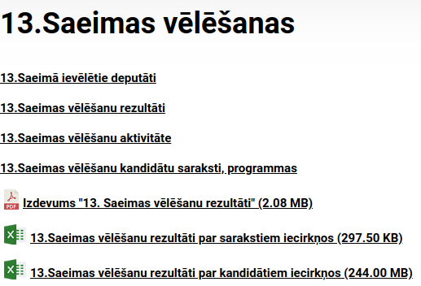

# Kandidātu saraksti

[Uz sākumu](http://85.254.250.28/downloads1/zpd-election-ads/)  
**Anotācija:** Šajā lapā apskatām kandidātu sarakstus 
(it īpaši Rīgā un Vidzemē). Katrā sarakstā ir daudz kandidātu, 
kuri sacentās savā starpā par punktiem (faktiski - 
plusiņu un svītrojumu skaita starpību). Ne visi kandidāti sarakstā ir 
labi pazīstami vairumam vēlētāju. Daži (visbiežāk saraksta augšgalā esošie) 
ir vislabāk izreklamēti - vēlētāju ar tiem iepazīstina afišu stabos, bukletos, 
priekšvēlēšanu debatēs.  
Šajā sadaļā aplūkosim vispārīgo tendenci - kā vieta sarakstā iespaido 
Rīgas un Vidzemes kandidāta saņemto plusiņu un svītrojumu skaitu.

## Kādi spēki varētu iespaidot kandidāta plusiņu/svītrojumu skaitu

**Definīcija:** Par *ranžējumu* sauksim noteiktas partijas 
kandidātu izkārtojumu noteikta vēlēšanu apgabala sarakstā. 
Varam runāt, piemēram, par "Jaunās Vienotības ranžējumu Rīgā". 
Tas pasaka, kurš šajā sarakstā kandidē ar pirmo numuru, kurš 
ar otro, utt. 

* Kandidāta objektīvā atpazīstamība. Pēc neoficiālas informācijas dažas
partijas ranžē kandidātus savos sarakstos, izmantojot socioloģisku firmu 
pakalpojumus. Būtu jāmēra dažādu partiju kandidātu 
klātbūtne plašsaziņas līdzekļos, Interneta vietnēs arī **pirms** vēlēšanām, 
arī - cik bieži par kandidātu runā citi cilvēki un kādā kontekstā tas notiek.
* Kandidāta reputācija savas partijas vadības un galveno sponsoru acīs. 
To grūti tieši izmērīt, bet tā var netieši izpausties, ja kandidātam 
piedāvā izdevīgāku vai mazāk izdevīgu apgabalu vai vietu, biežāk rāda viņa
seju partijas materiālos, sūta kā pārstāvi uz priekšvēlēšanu pasākumiem. 
Vieta Nr.3 Vidzemē parasti kotēsies augstāk nekā 
Nr.17 Kurzemē vai Latgalē.
* Kandidāta vārda ģeometriskais novietojums vēlēšanu zīmē. 
Vai tas atrodas saraksta augšgalā vai vidū vai apakšā? 
Varbūt tas viegli atpazīstams garuma vai neparastuma dēļ? 
* Kandidāta individuālās reklāmas - krītpapīra lapiņas iedzīvotāju 
pastkastītēs ar kandidāta foto, kalendārīši un citi suvenīri ar kandidāta
vārdu, soctīklu aktivitātes, klātienes tikšanās ar vēlētājiem un dalība pasākumos, iespējams, 
arī slēptā reklāma, ko gan var būt grūti pazīt un izmērīt. 

Mums, diemžēl, nav pieejamas kandidātu individuālās reklāmas, jo pēc vēlēšanām 
tās pirmās pazūd, no pastkastītēm nonākot mistkastēs. 
Kandidāti bieži vien ar tām nelepojas pat savu partijas
biedru vidū, lai neizskatītos, ka viņi pārāk centīgi velk deķīti uz savu pusi un 
nerūpējas par partijas kopējo rezultātu.
Tādēļ pētījumā "meklēsim, kur gaišāks" - aplūkosim divus saistītus jautājumus: 

1. Kā vēlēšanu zīmes ģeometrija iespaido rezultātu - plusiņus un svītrojumus. 
Vietu sarakstā nevar uzskatīt par reklāmu (tā atkarīga no partijas vadības
voluntāra lēmuma), bet šīs vietas ietekme uz vēlēšanu iznākumu ļauj 
saprast, ar kādu "handikapu" jāsaskaras katram sarakstā iekļautajam kandidātam. 
(Visticamāk, tiem, kuri kandidē apgabalā, kur partiju atbalsta maz, kuri 
atrodas tuvāk saraksta beigām, vajadzīga dārgāka individuālo reklāmu kampaņa). 
2. Vai kandidātu ranžējuma izmaiņas pašas par sevi (nesaistīti ar vēlēšanu 
zīmes ģeometriju) rada izmaiņu vēlēšanu iznākumā - tas netieši parāda 
arī spices kandidātu reklāmu iedarbību. To, protams, nevaram 
izpētīt tikai 13.Saeimas vēlēšanu rezultātos, jo kandidātu secību nevaram 
mainīt. Varam toties salīdzināt, kā tie paši kandidāti sacentās agrāko 
Saeimu vēlēšanās. 

## Individuālo grozījumu pētīšanas gaita

Mūsu pieejas pamatā ir vairāki pieņēmumi: 

* Jebkuras partijas sarakstā ir daudz kandidātu, 
vairums vēlētāju ir iepazinušies tikai ar dažiem no viņiem. 
* Nepieciešamība pieņemt aptuveni 30 lēmumus (par katru kandidātu 
izdomājot, vai viņu svītrot, plusot vai atstāt neaiztiktu) 
daļai vēlētāju ir apgrūtinoša. Tādēļ viņi groza nevis visu sarakstu, 
bet izdara tajā tikai nedaudzus svītrojumus vai plusiņus.
* Katra saraksta galvgalis jeb lokomotīves (vācu: "die Spitzenkandidaten" - 
spices kandidāti) biežāk parādās partijas kopīgajās reklāmās. Tie 
var būt 3 kandidātu foto uz afišu staba, 5 kandidātu attēli uz bukleta vāka, 
2-3 kandidāti, kuri aktīvi piedalās vēlēšanu debatēs. 
Kandidāta sekmes var iespaidot iekļūšana šajā "spicē". 

Ceram izdarīt divas lietas: 

1. Saskaitot grozījumus (plusiņus un svītrojumus) dažādos vēlēšanu sarakstos
it īpaši Rīgā un Vidzemē, sapratīsim, par cik lielu "spici" parasti ir jēga
runāt individuālo kandidātu izreklamēšanas kontekstā. 
(Vai tie ir pirmie 2, pirmie 3, pirmie 5?)
2. Salīdzinot ar agrāku gadu vēlēšanām sapratīsim, cik lielā mērā kandidātam palīdz
atrašanās starp spices kandidātiem, t.i. lielākas iespējas iepazīstināt 
ar savu kandidatūru, izmantojot pašas partijas resursus, nevis 
patstāvīgi veidotas individuālās kampaņas.

## Kā savākti dati

1. Apmeklē [CVK lapu](https://www.cvk.lv/lv/velesanas/saeimas-velesanas/13-saeimas-velesanas).
2. Lejuplādē CVK datus par kandidātiem (links "13.Saeimas vēlēšanu
rezultāti par kandidātiem iecirkņos (244.00 MB)").

3. Atver failu ar LibreOffice Calc un noglabā katru no 5 izklājlapām kā CSV failu
(atbilstoši vēlēšanu apgabaliem - Rīga, Vidzeme, Latgale, Kurzeme, Zemgale). 

* [Rīgas apgabals](candidates/riga-plusi-svitrojumi.csv)
* [Vidzemes apgabals](candidates/vidzeme-plusi-svitrojumi.csv)
* [Latgales apgabals](candidates/latgale-plusi-svitrojumi.csv)
* [Kurzemes apgabals](candidates/kurzeme-plusi-svitrojumi.csv)
* [Zemgale apgabals](candidates/zemgale-plusi-svitrojumi.csv)

## Vēlēšanu zīmju ģeometrija

1. [LKS Rīgā 15+15](candidates/lks-riga.jpg)
2. [A-PAR Rīgā 19+19](candidates/a-par-riga.jpg)
3. [JV Rīgā 19+19](candidates/jv-riga.jpg)
4. [A-PAR Vidzemē 14+14](candidates/a-par-vidzeme.jpg)
5. [Vienotība Vidzemē 14+14](candidates/jv-vidzeme.jpg)

## Diagramma: Punkti atkarībā no vietas sarakstā

