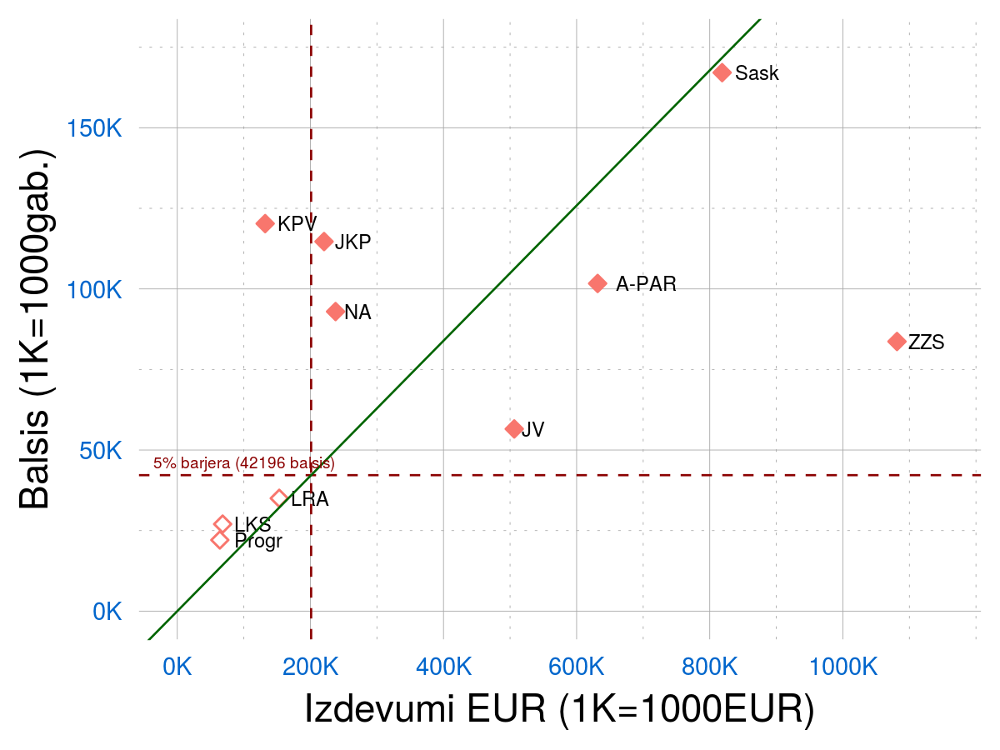

# Partiju tēriņi un rezultāti: Korelācijas

[Uz sākumu](http://85.254.250.28/downloads1/zpd-election-ads/)  
**Anotācija:** Šajā lapā aplūkosim nevis atsevišķo partiju kampaņu efektivitāti, 
bet kā mainās balsu skaits (atkarīgais parametrs - vertikālā jeb Y ass) no kampaņā 
iztērētās naudas (neatkarīgais parametrs - horizontālā jeb X ass). 
Izvilksim lineārās regresijas taisni, kas tuvināti apraksta 
balsu skaita pieaugumu atkarībā no iztērētās naudas un aprēķināsim 
Pīrsona korelācijas koeficientu. Tas parādīs, cik spēcīga ir saņemto 
balsu skaita atkarība no reklāmās ieguldītās naudas. 

## Diagrammas

Softs, ar kuru zīmētas korelāciju diagrammas (valoda R): [correlations.R](correlations.R)

**Iegūtās balsis atkarībā no kampaņā iztērētās naudas:**

## Lineārā regresija

Tumši zaļā svītra, kura attēlā ir gandrīz horizontāla, apzīmē 
korelācijas taisni. Tā ir taisne, kuras attālumu kvadrātu summa 
līdz visu 7 Saeimā 
tikušo partiju datu punktiem (balsis/izdevumi) ir vismazākā. 
Faktiski starp Saeimā iekļuvušajām partijām rezultāta atkarība no 
kampaņā ieguldītās naudas ir ļoti vāja; septiņi sārtie rombiņi nav
izvietojušies kādas lineāri augošas taisnes tuvumā, tie ir juceklīgi 
izmētāti. Korelācijas koeficients $k=0.02$ nozīmē, ka
vēlēšanu iznākuma atkarība no reklāmā ieguldītās naudas faktiski nav. 

Vai tas nozīmē, ka Saeimā var iekļūt vispār bez naudas? 
Tas, protams, nebūtu patiesība, jo ir diezgan lieli sākotnējie/fiksētie izdevumi, 
kas partijai nepieciešami, lai vispār varētu iestāties spēlē un pārvarēt 5% barjeru. 
(Pēc tam, kad partija šo sākotnējo barjeru pārvarējusi, tālāka naudas tērēšana 
vairs nav efektīva - kā to redzam, salīdzinot ZZS un KPV rezultātus.)

Lai iegūtu vismaz pirmo priekšstatu par reklāmai nepieciešamo summu, izdarīsim 2 pieņēmumus: 

* Partijas darbības efektivitāte, "pārvēršot" reklāmu vēlētāju balsīs,
nav ekstrēma (kā ZZS vai KPV), bet ir vienāda ar vēlēšanās sasniegto caurmēru: 
$$\frac{m_1+m_2+\ldots+m_10}{v_1+v_2+\ldots+v_{10}}$$
Šajā formulā $m_i$ apzīmē $i$-tās partijas iztērēto naudu, bet $v_i$ - iegūtās balsis. 
Ievietojot skaitļus no KNAB pieejamajām partiju deklarācijām (izdoto naudu) 
un CVK publicētajiem datiem par balsīm, iegūstam attiecību 4.76 EUR. Tas ir 
13.Saeimas vēlēšanu laikā izdotais naudas daudzums par 1 vēlētāja balsi ("vidējo" 
balsi, kas dažādām partijām var būtiski atšķirties). 
* Šādi iegūto vienas balss "cenu" reizinām ar 5% barjeru. 
Iegūstam $4.76 \cdot{} 42196 = 200853$

Secinām, ka Saeimā iekļuvušai partijai vajadzētu iztērēt vismaz 200 tūkstošus EUR 
(atrasties pa labi no vertikālās raustītās līnijas).
Pretējā gadījumā - vai nu netiks pārsniegta barjera, vai arī jāpieņem, ka 
partijas priekšvēlēšanu kampaņa izdosies labāk nekā "rekordistiem" no KPV - 
A.Kaimiņam, A.Gobzemam u.c. Visas citas Saeimā iekļuvušās partijas minētos 200 tūkstošus
eiro iztērēja. Savukārt, LRA, LKS, Progresīvie netika un arī nesasniedza šo summu. 
Nevar, protams, apgalvot, ka viņi tiktu, ja būtu tērējuši vairāk - bet pārāk taupīga 
kampaņa, visticamāk, negatīvi iespaidoja viņu rezultātu.

## Secinājumi

1. Jāuzsver, ka korelācija nenozīmē cēloņsakarību. Partijas iztērētajai 
naudai un saņemto balsu skaitam, nenoliedzami, ir kopsakars: Partijas, kuras
ir lielas, Latvijas politikā darbojas pietiekami aktīvi, izveidojušas
plašu atbalsta tīklu reģionālo organizāciju izskatā, parasti arī saņem 
salīdzinoši daudz balsu vēlēšanās un daudz ziedojumu, ko izmantot sevis reklamēšanai. 
Tas tomēr nenozīmē, ka nauda tieši (vai vēl jo vairāk - lineāri) iespaidotu 
vēlēšanu rezultātu, t.i., iztērējot divreiz vairāk naudas, varētu iegūt 
divreiz lielāku rezultātu. 
2. Ir tomēr zināms naudas daudzums, zem kura partijai ir grūti sasniegt 
nospraustos mērķus. To mēģinājām novērtēt lineārā modelī (cik daudz naudas 
vajadzīgs, ja caurmēra cenu par vienu balsi reizinām ar vēlētāju skaitu 5% barjeras
pārsniegšanai).
Novērojam, ka dažām partijām (piemēram, "Progresīvajiem") bija drusku par maz
naudas, lai veiksmīgi reklamētos.
3. **Ko gribētos pētīt tālāk?** 13.Saeimas vēlēšanas bija drusku neparastas - 
pēc dažu politologu (kuru?) atzinuma tur sacentās "vecie" politiskie spēki - 
Jaunā Vienotība, ZZS, Nacionālā Apvienība ar nosacīti "jaunajiem" 
politiskajiem spēkiem: Attīstībai/PAR, KPV un JKP. Tādēļ var gadīties, ka 
"vecajām" partijām vajadzēja pavisam citādas reklāmas kampaņas, lai varētu 
sacensties ar "jaunajām" un parasti tās izmaksāja krietni dārgāk. 
Tādēļ būtu interesanti aplūkot korelācijas plašākai datu kopai - apskatīt
arī iepriekšējo Saeimu vēlēšanas, pašvaldību vēlēšanas u.c. Tas ļautu 
iegūt precīzākus secinājumus par kampaņu naudas plānošanu.

