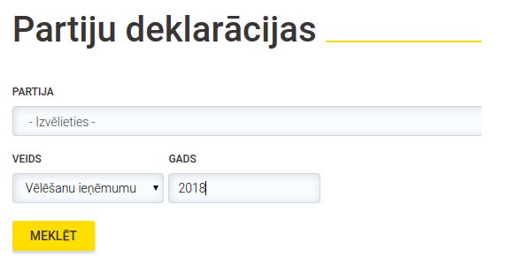

# Partiju tēriņi un rezultāti

[Uz sākumu](http://85.254.250.28/downloads1/zpd-election-ads/)  
**Anotācija:** Šajā lapā apkopoti partiju (oficiāli, KNABam iesniegtie) 
13.Saeimas priekšvēlēšanu kampaņas izdevumi. 

## Partiju deklarācijas

**Datu savākšanas metodika:**

1. Apciemo KNAB mājaslapu: [https://www.knab.gov.lv/lv/db/declaration/](https://www.knab.gov.lv/lv/db/declaration/)
2. Izvēlas no saraksta kādu no partijām, kas ieguva vismaz 2% 13.Saeimas vēlēšanās. 
3. Izvēlas gadu "2018" un deklarācijas veidu "Vēlēšanu ieņēmumu un izdevumu deklarācija". 
4. Spiež pogu **Meklēt**. 

5. Ja parādās vairāki rezultāti, tad izvēlamies jaunāko no tiem.

**Saraksts ar deklarācijām:**

1. ["Saskaņa" sociāldemokrātiskā partija](declarations/Sask.pdf)
2. [Politiskā partija “KPV LV”](declarations/KPV.pdf)
3. [Jaunā konservatīvā partija](declarations/JKP.pdf)
4. [Attīstībai/Par!](declarations/A-PAR.pdf)
5. [Nacionālā apvienība VL-TB/LNNK](declarations/NA.pdf)
6. [Zaļo un Zemnieku savienība](declarations/ZZS.pdf)
7. [Jaunā Vienotība](declarations/JV.pdf)
8. [Latvijas Reģionu Apvienība](declarations/LRA.pdf)
9. [Latvijas Krievu savienība](declarations/LKS.pdf)
10. [Progresīvie](declarations/Progr.pdf)

## CSV datu fails

Valsts iestādes (t.sk. KNAB) nereti glabā skenētus dokumentus. Mūsu gadījumā
PDF faili satur attēlus (faktiski partiju finanšu dokumentu fotogrāfijas). 
Mūs interesējošās tabulu ailes būtu grūti automatizēti atrast (katrai partijai 
tabulas izkārtojums nedaudz atšķiras). Nav arī vienkārši tos bez kļūdām pārvērst 
no attēla skaitliskā formātā (veikt OCR - *optical character recognition*). 
Pirms partiju izdevumus var apstrādāt kā skaitļus un attēlot diagrammās, tie ar roku jāpārraksta 
izklājlapas tabulā.

Populārs mašīnlasāmu datu formāts ir CSV (comma-separated values). To var iegūt, 
piemēram, saglabājot izklājlapu ar LibreOffice Calc programmu. 
(Var lietot arī citu populāru programmu - Microsoft Excel, bet tur var būt 
jāuzmanās ar ne-ASCII simbolu kodējumu, t.sk. latviešu burtiem ar diakritiskajām 
zīmēm.)

* [Partiju deklarāciju dati, ODS](declaration-data.ods) - LibreOffice izklājlapas formāts
* [Partiju deklarāciju dati, CSV](declaration-data.csv) - Vienkārša teksta formāts

## Diagrammas

**Vienas deputāta vietas izmaksas atkarībā no partijas**

**Vienas vēlētāja balss izmaksas atkarībā no partijas**

* [1 balss cena: Diagramma](declarations/barchart1.png)

**Ieņēmumu un izdevumu salīdzinājums**

